# DPhil / PhD doctoral thesis template


LaTeX template for an undergraduate 4th year project (4YP) report
or a DPhil thesis for a student of the 
[Department of Engineering Science](https://www.eng.ox.ac.uk) at 
the [University of Oxford](https://www.ox.ac.uk). Although originally created
for a student at Oxford, I included some examples below for a PhD thesis for
the Massachussetts Institute of Technology and (cough, cough) the University
of Cambridge. It should be easy for you to adjust this template to suit the
requirements of other academic institutions.

&nbsp;

> "OxEngThesis" is free software: you can redistribute it or modify it
under the terms of the GNU General Public License as published by the Free 
Software Foundation, version 2 only. Check the file [COPYING](COPYING) for
more information on the license and copyright.

&nbsp;

As a student at Oxford, a proportion of your time will be devoted to writing
science in a formal academic style. There are many resources that will help
you write your thesis, such as 
[Writing your thesis](https://www.mpls.ox.ac.uk/training/resources-for-researcher-and-career-development/completing-your-dphil/writing-up-your-thesis), 
[Completing your doctorate](https://www.vitae.ac.uk/doing-research/doing-a-doctorate/completing-your-doctorate),
[Essay and dissertation writing skills](https://www.ox.ac.uk/students/academic/guidance/skills/essay)
and also other [resources for new students](https://cameralab.eng.ox.ac.uk/resources_new_students.html). 
Steven Pinker's talk on 
[Linguistics, Style and Writing in the 21st Century](https://youtu.be/OV5J6BfToSw) 
will provide you with sound advice on writing. 

My students have found very helpful to use the LaTeX typesetting system to write
reports, theses, journal papers or other academic documents. You can write your
LaTeX documents from scratch, however, it is often easier to start
with an already written template. This way, you can focus (as your supervisor
and your viva panel expect) on writing about your exciting research 
contributions rather than spending time formatting your document or applying 
other cosmetic changes. To this end, this repository contains a LaTeX
template that can be used for a 4th year project (4YP) report or a DPhil / PhD 
thesis. The typical 4YP report contains around 50 pages, whereas a DPhil / PhD
thesis is a much larger document.

The main class file is [oxengthesis.cls](oxengthesis.cls). Two sample 
documents are provided: [sample_4yp_report.tex](sample_4yp_report.tex) and
[sample_dphil_thesis.tex](sample_dphil_thesis.tex) depending on if you are 
writing a 4YP report or a DPhil thesis respectively. You can check the 
output of corresponding PDF documents 
[sample_4yp_report-sample_output.pdf](sample_4yp_report-sample_output.pdf) and
[sample_dphil_thesis-sample_output.pdf](sample_dphil_thesis-sample_output.pdf).
The following screenshots give you an idea of how the documents looks:

&nbsp;

<p align="center">
    <kbd></kbd>
    ...
    <kbd>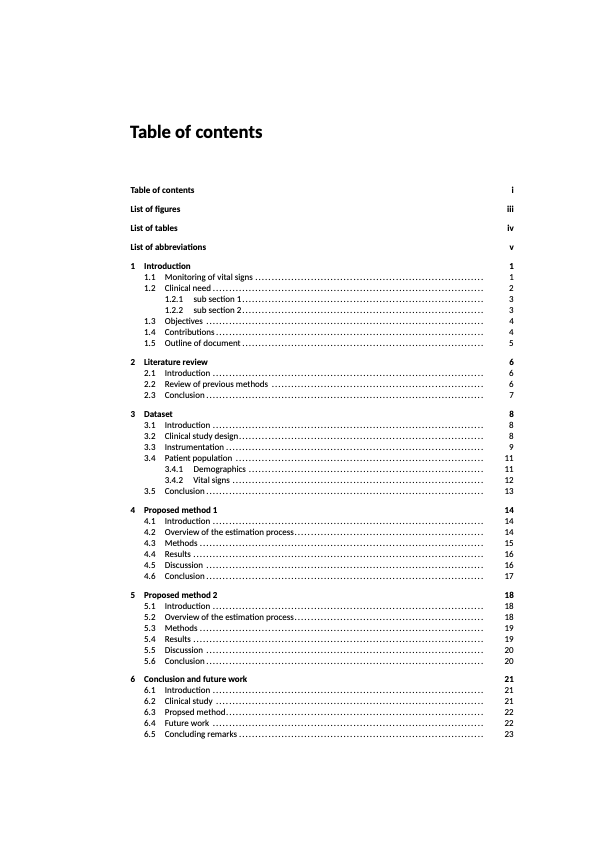</kbd>
</p>
<h2> <p align="center"> ... </p> </h2>
<p align="center">
    <kbd></kbd>
    ...
    <kbd>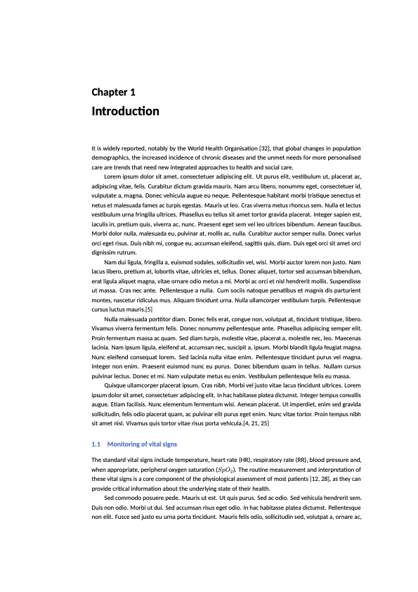</kbd>
</p>
<h2> <p align="center"> ... </p> </h2>
<p align="center">
    <kbd>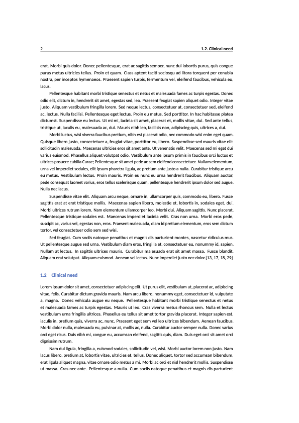</kbd>
    <kbd>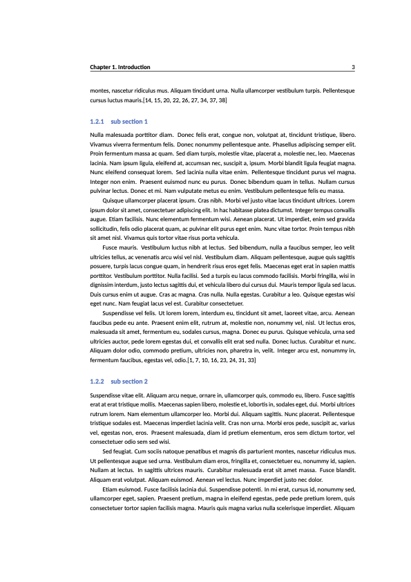</kbd>
</p>
<h2> <p align="center"> ... </p> </h2>
<p align="center">
    <kbd>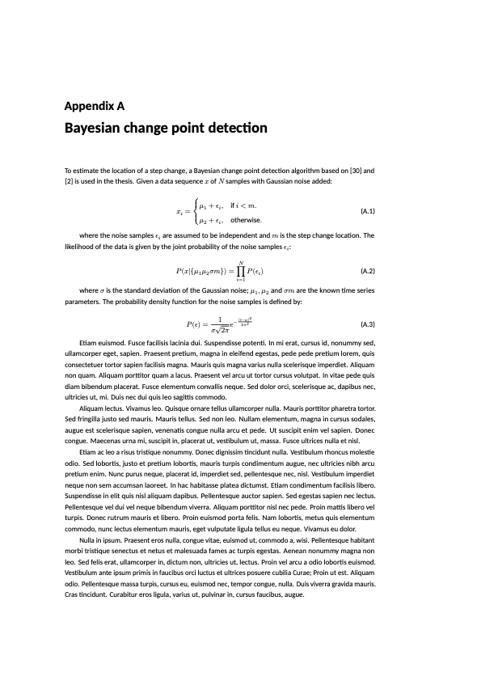</kbd>
    <kbd>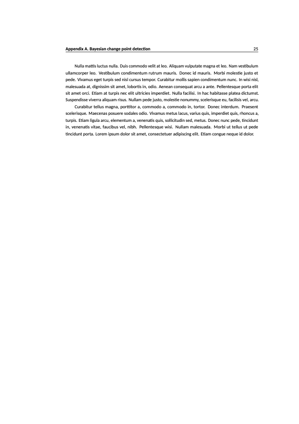</kbd>
</p>
<h2> <p align="center"> ... </p> </h2>
<p align="center">
    <kbd>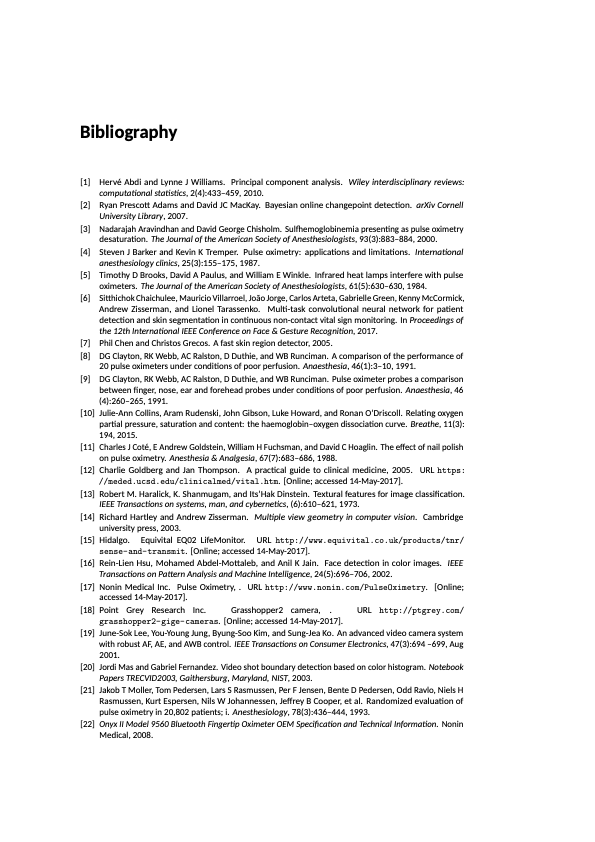</kbd>
    <kbd>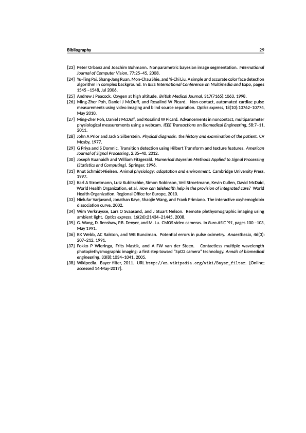</kbd>
</p>

&nbsp;

## Requirements

There are several options for writing in LaTeX, including online versions such
as Overleaf. I don't recommend online editors, as you will be writing long
documents with several figures, tables and other elements. In my experience, 
having LaTeX installed locally in your computer is a better option.

You will need a modern LaTeX compiler installed in your system, at minimum
version 2017. Most modern operating systems use 
[TexLive](https://www.tug.org/texlive/) as the preferred LaTeX typesetting
system. If you are using Linux, TexLive is already pre-installed or is readily 
available from your distribution's software repository, for example: 
[LaTeX in Fedora](https://docs.fedoraproject.org/en-US/neurofedora/latex/) and
[LaTeX in Ubuntu](https://help.ubuntu.com/community/LaTeX). For macOS, you can
download and install the latest [MacTeX](https://tug.org/mactex) distribution. 
For Microsoft Windows, follow the installation instructions described in
[TexLive on Windows](https://tug.org/texlive/windows.html)


Install the Carlito font (if it's not already installed in your system).
Follow the instructions for your particular operating system in the
[fonts](fonts) directory, for example for [Linux](fonts/INSTALL_FONTS_LINUX.md)
or [macOS](fonts/INSTALL_FONTS_macOS.md). If you are using Microsoft Windows, 
also install the Latin Modern Math font.


## LaTeX editors

There are several editors available that will make your life easier when
writing LaTeX documents and, ultimately, generating the final PDF file (a.k.a 
compiling the LaTeX source files). For macOS and iOS, you can use
[Texifier](https://www.texifier.com). Good editors for Linux are
[Kile](https://apps.kde.org/en-gb/kile) and 
[TeXMaker](https://www.xm1math.net/texmaker).

The LaTeX files in this repository require the 
[LuaLaTeX](https://en.wikipedia.org/wiki/LuaTeX) engine. You editor should 
allow you to configure LuaLaTeX as the typesetting engine for your document
and automatically take care of the compilation process to generate the final
PDF document.

&nbsp;

# Writing your thesis

## Preparing your document

After you installed your preferred LaTeX editor, copy either the file 
[sample_dphil_thesis.tex](sample_dphil_thesis.tex) or
[sample_4yp_report.tex](sample_4yp_report.tex) to a new file depending
on if you are writing a DPhil thesis or a 4YP report respectively. Throughout
this tutorial, I will call this new file your "*main LaTeX source file*".

The *frontmatter* section will be automatically created depending on the type
of document you are writing. If you want more control, you can review how the
'\makefrontmatterpages' command is defined in the
[oxengthesis.cls](oxengthesis.cls) class file. If you want all the sections
in the *frontmatter* to appear, you will need to create the following files:

- **[abstract.tex](abstract.tex)** : If you want the "Abstract" page
- **[dedication.tex](dedication.tex)** : If you want the "Dedication" page
- **[declaration.tex](declaration.tex)** : If you want the "Declaration" page
- **[acknowledgements.tex](acknowledgements.tex)** : If you want the 
  "Acknowledgements" page
- **[publications.tex](publications.tex)** : If you want the
  "List of publications" page
- **[glossary.tex](glossary.tex)** : If you want the
  "List of abbreviations" page

If any of the files above are missing, that particular secton won't be created
in the *frontmatter*. This is useful if you are just preparing a draft version
of your thesis for your supervisor to correct. 

Similarly, add all the BibTeX citations to a file named 
[references.bib](references.bib) if you want the "Bibliography" section to be
created at the end of your document. 

## Creating the PDF output

The LaTeX files in this repository require the 
[LuaLaTeX](https://en.wikipedia.org/wiki/LuaTeX) engine. You editor should 
allow you to configure LuaLaTeX as the typesetting engine for your document
and automatically take care of the compilation process to generate the final
PDF document from your "*main LaTeX source file*".

If you want to compile your "*main LaTeX source file*" from the command line, 
you can use the script [compile_document.sh](compile_document.sh) provided in 
this repository. This script only works in a Linux or macOS system. For
example, to compile the sample 4YP report, you will execute the following
command in the terminal:

```shell
$ ./compile_document.sh  sample_4yp_report.tex
```

If you want to delete all the temp or auxiliary files LaTeX created during
the compilation process, you can run:

```shell
$ ./remove_latex_aux_files.sh
```


If you are compiling the document manually, you would need to run the
[latexmk](https://ctan.org/pkg/latexmk) build command (already part
of your LaTeX distribution) in the following order:

```shell
$ latexmk -pdflatex=lualatex -pdf  sample_4yp_report.tex
$ makeglossaries sample_4yp_report.tex
$ latexmk -pdflatex=lualatex -pdf  sample_4yp_report.tex
```

## Customising the title page

Although this LaTeX template was written and formatted for a student at the
University of Oxford, it should be easy for you to customise it to suit the
requirements of your academic institution. The 
[default title page](titlepage-oxford.tex) is simple and customisable. The
class template defines some variables you can use. At minimum, you need to
provide the following definitions in the preamble of your 
"*main LaTeX source file*":

- **\title{}**:      The main title of the thesis/report
- **\author{}**:     The author of the thesis/report

You can define the following optional variables:

- **\supervisor{}**: The name of your thesis supervisor. The default value is:
    "*SUPERVISOR NAME*"
- **\college{}**: Your college affiliation, if you are an Oxford student.
    The default value is: "" (an *empty string*)
- **\degreeprefix{}**: Text printed before the degree name. The default value
    is: "*A thesis submitted for the degree of*"
- **\degree{}**: The name of the degree. The default value is:
    "*Doctor of Philosophy*"
- **\department{}**: Your university department. The default value is:
    "*Department of Engineering Science*"
- **\university{}**:   The name of your university. The default value is:
    "*University of Oxford*"
- **\universitylogo{}**: File name of the university's logo, without the file
    extension. The default value is: "*oxford-logo*" (which will load the
    image file [oxford-logo.png](figures/oxford-logo.png))
- **\date{}**: The date of publication of the thesis, such as
    "*Hilary Term, 2048*". If you leave it blank, it will print the
    current date (useful when sending a draft to your supervisor)


For examples on how to define the above variables, you can review the files
[sample_dphil_thesis.tex](sample_dphil_thesis.tex) / 
[sample_4yp_report.tex](sample_4yp_report.tex), depending on if you are writing
a DPhil thesis or a 4YP report respectively. These two files use the default
title page [titlepage-oxford.tex](titlepage-oxford.tex), which produces the
following outputs:

&nbsp;

<p align="center">
    <kbd></kbd>
    ...
    <kbd></kbd>
</p>

&nbsp;

## Create your own title page

If you don't provide a custom title page, the [oxengthesis.cls](oxengthesis.cls)
class template will load the default title file 
[titlepage-oxford.tex](titlepage-oxford.tex) shown above. If the layout of the
default title page does not fulfill your or your university's requirements, 
you can create your own title page. To do so, you will need to follow the 3 
steps described below. As an example, we will create a custom title page for a
PhD thesis for a student at the Massachusetts Institute of Technology:

1. Create a new LaTeX source file and add your own definitions, such as the
   example file [titlepage-mit.tex](titlepage-mit.tex)

2. Define the "**\titlepage{}**" variable in the preamble of your 
   "*main LaTeX source file*". For example, after the "\author{}"
   variable as in:

```latex
\title    {Protein expression of the X-factor mutator gene in Homo Sapiens}
\author   {Charles F. Xavier}
\titlepage{titlepage-mit.tex}
```

3. Recompile your "*main LaTeX source file*". An example of the output is:

&nbsp;

<p align="center">
    <kbd>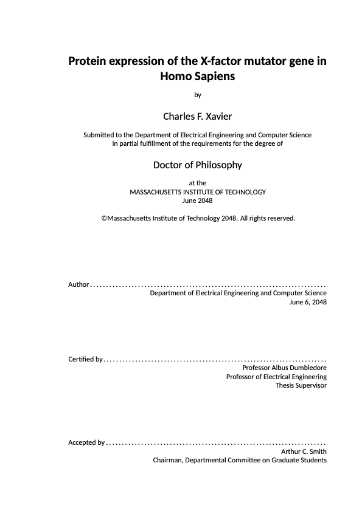</kbd>
</p>

&nbsp;

The following text in the preamble of your "*main LaTeX source file*" will use
the [titlepage-cambridge.tex](titlepage-cambridge.tex) file to create a title
page for a student at the University of Cambridge:

```latex

\title      {Protein expression of the X-factor mutator gene in Homo Sapiens}
\author     {Charles F. Xavier}
\college    {Pembroke College}
\degreeprefix {A thesis submitted for the degree of}
\degree     {Doctor of Philosophy}
\supervisor {Professor Albus Dumbledore}
\department {Department of Engineering}
\university {University of Cambridge}
\universitylogo{cambridge-logo}
\date       {June 2048}
\titlepage  {titlepage-cambridge.tex}

```


The sample output is shown below:

&nbsp;

<p align="center">
    <kbd>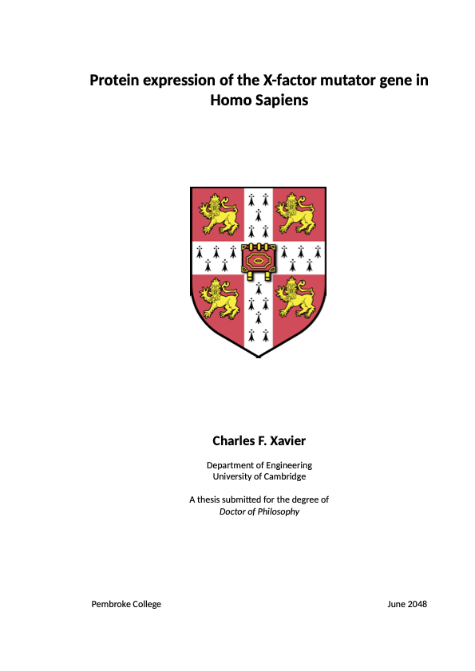</kbd>
</p>

&nbsp;

The [oxengthesis.cls](oxengthesis.cls) class template makes available new LaTeX
commands you can use in your new custom title document. These new commands are 
based on the variables defined in the preamble of your
"*main LaTeX source file*":

- The **\title{}** variable in the preamble will map to the command **\TitleName**
- The **\author{}** variable in the preamble will map to the command **\AuthorName**
- The **\supervisor{}** variable in the preamble will map to the command **\SupervisorName**
- The **\college{}** variable in the preamble will map to the command **\CollegeName**
- The **\degreeprefix{}** variable in the preamble will map to the command **\DegreePrefix**
- The **\degree{}** variable in the preamble will map to the command **\DegreeName**
- The **\department{}** variable in the preamble will map to the command **\DepartmentName**
- The **\university{}** variable in the preamble will map to the command **\UniversityName**
- The **\universitylogo{}** variable in the preamble will map to the command **\UniversityLogo**
- The **\date{}** variable in the preamble will map to the command **\DegreeDate**

Check the files [titlepage-oxford.tex](titlepage-oxford.tex),
[titlepage-mit.tex](titlepage-mit.tex) and 
[titlepage-cambridge.tex](titlepage-cambridge.tex) for examples on how to use
the available commands in your new title page.

&nbsp;

# Additional features

The [oxengthesis.cls](oxengthesis.cls) class template is based on the
[memoir](https://ctan.org/pkg/memoir) LaTeX package, with the addition
of several other packages and features. In this section, I will summarise some
of them, but take a look at the [oxengthesis.cls](oxengthesis.cls) file and the
sample [sample_dphil_thesis.tex](sample_dphil_thesis.tex) / 
[sample_4yp_report.tex](sample_4yp_report.tex) documents for a more 
complete overview.


## Mark text as TODO


You can wrap text in "todo" tags, so they appear in red colour in the PDF
document. For example: 

```latex
    \todo{Add a citation to reference the latest research}
```


## Figures


I use the [graphicx](https://ctan.org/pkg/graphicx) LaTeX package to include
figures. You can put all figures in a "figures/" folder and you can simply 
include the image file directly without the file extension, as in:

```latex
\begin{figure}
    \centering
    \includegraphics[width=0.9\linewidth]{dummy_image}
    \caption
    {
        Sample image.
        \label{fig:sample_image}
    }
\end{figure}
```

the code above will insert the image file "./figures/dummy_image.png".

You can create a figure with sub plots with:

```latex
\begin{figure}[
    \centering
    \subbottom[\label{fig:subfig_example:fig1}]{
        \includegraphics[width=0.3\linewidth]{dummy_image}
    }
    \subbottom[\label{fig:subfig_example:fig2}]{
        \includegraphics[width=0.3\linewidth]{dummy_image}
    }
    \subbottom[\label{fig:subfig_example:fig3}]{
        \includegraphics[width=0.3\linewidth]{dummy_image}
    }
    \caption[The PointGrey Grasshopper2 video camera]
    {
        Caption of the figure, showing:
        \subcaptionref{fig:subfig_example:fig1} description 1,
        \subcaptionref{fig:subfig_example:fig2} description 2 and
        \subcaptionref{fig:subfig_example:fig3} description 3.
        \label{fig:subfig_example}
    }
\end{figure}
```

which will automatically produce the following output:

<p align="center">
    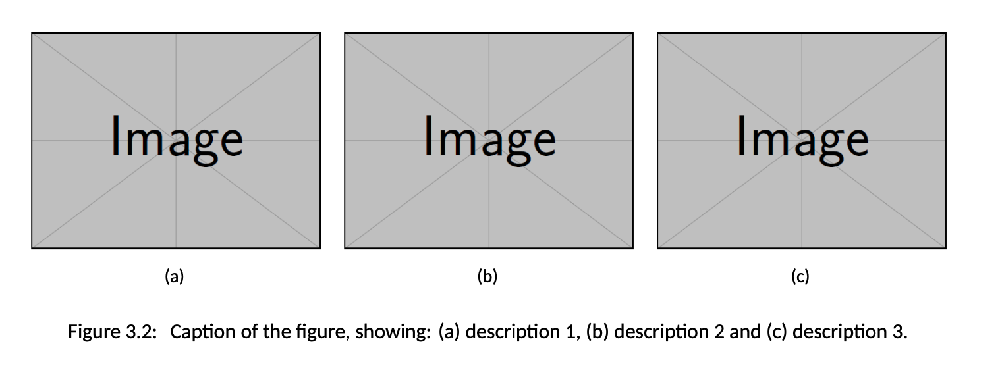
</p>

Note that you can directly refer to the subplot as in:

```latex
\Cref{fig:subfig_example:fig1} shows the camera ...
 ```

 which will automatically produce the text:
 
 ```
 Figure 3.2(a) shows the camera ...
 ```


 ## Tables

 You can have tables with shaded headers with:


 ```latex
\begin{table}
    \centering
    \caption{General features and specification for ...}
    \singleTableRowHeight
    \begin{tabular}{ll}

        \tableHeaderStart
        \tableHCell{Item} & \tableHCell{Description} \\
        \tableHeaderEnd

        Imaging Sensor        & Sony ICX625 2/3" progressive scan CCD \\
        Image size (pixels)   & 2448 (H) x 2048 (V)                   \\
        Pixel Size            & 3.45 \si{\micro\metre} x 3.45 \si{\micro\metre} \\
        A/D Converter         & AD9977 14-bit, dual-channel           \\
        Max frame rate        & 15 FPS                                \\
        Video Data Output     & 8, 12, 16 and 24-bit digital data     \\
        Gain \& Exposure                  & Automatic/Manual/One-Push \\
        Lens Mount            & C-mount                               \\
        Interface             & Gigabit Ethernet                      \\
        Physical dimensions   & 44 (W) mm x 29 (H) mm x 58 (L) mm     \\
        \hline 

    \end{tabular}
    \label{table:camera_specs}
\end{table}
 ```

which will produce the following output:

<p align="center">
    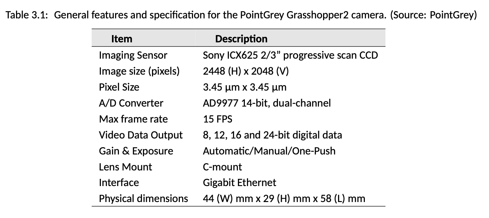
</p>

or you can have more complex tables as in:

```latex
\begin{table}[htb]
  \centering
  \caption{Summary of population demographics in the training and test sets}
  {
    \small
    \begin{tabular}{p{2cm} c c c c c c c c c c}
      \toprule

      Set &
      \multirowcell{2}{Number of\\subjects} &
      \multirowcell{2}{Total time\\(hours)}$^1$ &
      \multicolumn{2}{c}{Gender} &      
      \multicolumn{6}{c}{Ethnicity$^2$}  \\

      \cmidrule{4-11}
        
      &  &  & Male & Female & W & B & A & WB & WA & O  \\
      \midrule
      Training  & 15 & 216.6 & 8  & 7  & 10 & 1   & 1 & 1 & 1 & 1 \\        
      Test      & 15 & 210.0 & 10 & 5  & 10 & $-$ & 1 & 1 & 2 & 1 \\        
      \midrule        
      Total	& 30 & 426.6 & 18 & 12 & 20 & 1   & 2 & 2 & 3 & 2 \\
        
      \bottomrule
        
      \multicolumn{11}{l}
      {
        \footnotesize $^1$ Period during which both reference and estimated data were being recorded simultaneously.        
      } \\        
      \multicolumn{11}{l}
      {        
        \footnotesize $^2$ W = White, B = Black, A = Asian, WB = Mixed White \& Black, WA = Mixed White \& Asian and O = Other.        
      } \\
        
      \end{tabular}      
  } 
  \label{table:patient_demographics}
\end{table}
```

which will produce the following output:

<p align="center">
    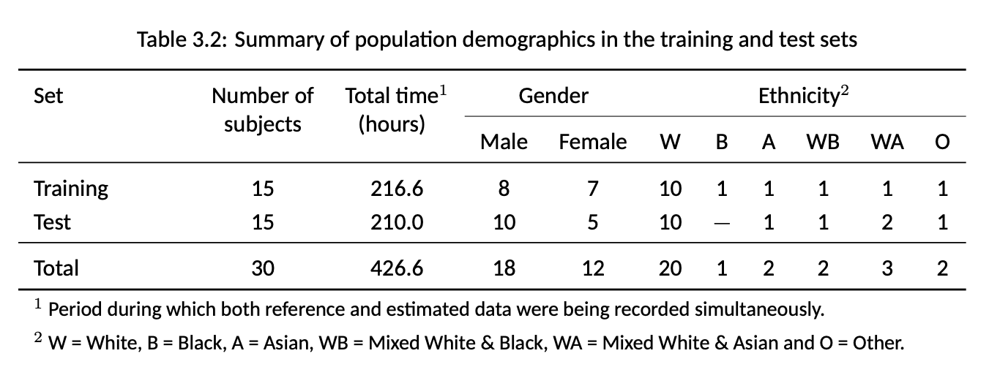
</p>


## Cross-referencing labels


The [cleveref](https://ctan.org/pkg/cleveref) package is used to
improve cross references to chapters, sections, figures and other common
LaTeX labels. For example the following text:

```latex
\Cref{chapter:literature_review} discusses .... is presented in 
\cref{chapter:dataset} with a detailed ...


The summary of the demographics for the entire set is described in
\cref{table:patient_demographics} ...


\Cref{fig:subfig_example} shows the video camera used in the study.
\Cref{fig:subfig_example:fig1} shows the camera, as opposed to 
\cref{fig:subfig_example:fig2}, which shows the lens ...


```
will produce the following output:

```
Chapter 2 discusses .... is presented in chapter 3 with a detailed ...


The summary of the demographics for the entire set is described in table 3.2 ...


Figure 3.2 shows the video camera used in the study. Figure 3.2(a)
shows the camera, as opposed to figure 3.2(b), which shows
the lens ...

```


## Glossaries


I use the [glossaries-extra](https://ctan.org/pkg/glossaries-extra) package
to automatically add the "List of abbreviations" page in the *frontmatter*. 
Simply create a file with the name [glossary.tex](glossary.tex) and add all
your definitions. For example:

```latex
\newabbreviation[longplural={heart rates},description={Heart rate}]{hr}{HR}{heart rate}
\newabbreviation[description={Respiratory rate}]{rr}{RR}{respiratory rate}
\newabbreviation[sort=SpO2, description={Peripheral oxygen saturation, as measured by a pulse oximeter}]{spo2}{\ensuremath{SpO_2}}{peripheral oxygen saturation}

```

In your main document, you can later use tags such as:

```latex
The standard vital signs include temperature, \af{hr}, \af{rr}, 
blood pressure and, when appropriate, \af{spo2}...

...

\Cref{fig:phenylephrine_response} shows the typical vital-sign response
to the phenylephrine infusion for a 28-year-old female. As the dose 
increased, \af{hr} decreased, whereas \af{bp} and \af{pep} typically 
increased. \af{spo2} and \af{rr} had no significant correlations to the
dose of phenylephrine...

```

which will automatically create the following output:

```
The standard vital signs include temperature, heart rate (HR), 
respiratory rate (RR), blood pressure and, when appropriate, 
peripheral oxygen saturation (SpO2)...

...

Figure 2 shows the typical vital-sign response to the 
phenylephrine infusion for a 28-year-old female. As the dose 
increased, HR decreased, whereas blood pressure (BP) and
pre-ejection period (PEP) typically increased. SpO2 and RR 
had no significant correlations to the dose of phenylephrine...

```

Note that the first time you use an acronym, its full definition will be
provided. For the rest of the instances, only the acronym will be used. The
"List of abbreviations" page will be automatically created in the frontmatter:

<p align="center">
    <kbd>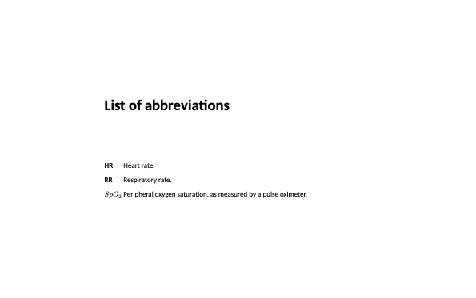</kbd>
</p>


## Mini-table of contents for each chapter


If you have a recent version of LaTeX installed (TeXLive version 2022 works)
in your system and would like to have a short table of contents at the 
beginning of each chapter, you can simply add the "*useminitoc*" option to
your document:

```latex
\documentclass[10pt,a4paper,twoside,openany,useminitoc,final]{oxengthesis}
```

Below is a sample output for one chapter:

<p align="center">
    <kbd>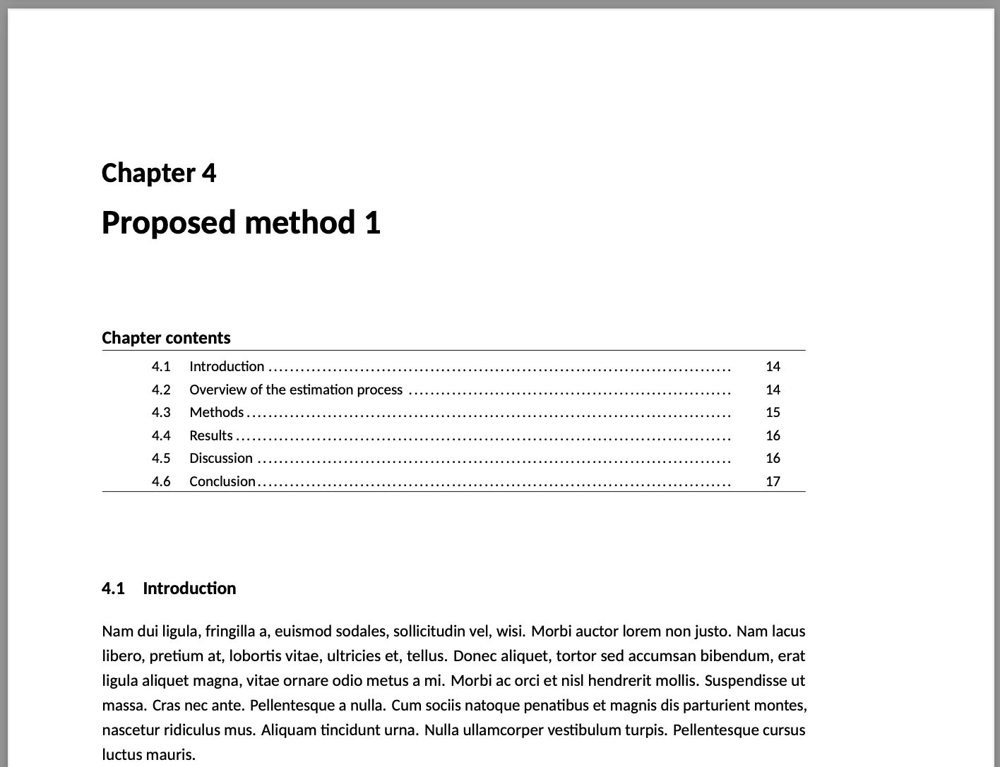</kbd>
</p>


I use the [minitoc](https://ctan.org/pkg/memoir) LaTeX package to create
the table of contents for each chapter. Previous versions of the minitoc class
where incompatible with the [memoir](https://ctan.org/pkg/memoir) class. I 
tested TexLive 2022 and MacTeX 2022, they both work fine.

## Abstract page for the Examination Schools


When submitting your final thesis to the "Examination Schools" (located on
High Street) at the University of Oxford to schedule your viva examination, 
you are typically required to submit two printed copies of your thesis 
(soft-bound). Additionally, you are required to provide two separate one-page
printed copies of your abstract. The stand-alone abstract page should contains
your name, college affiliation and is NOT meant to be part of the binding of
your thesis. To create this single stand-alone page of your abstract, add the
"*frontabstract*" option to your document, as in:

```latex
\documentclass[10pt,a4paper,twoside,openany,frontabstract,final]{oxengthesis}
```

The page will be created before the main title page. Below is a sample output:

<p align="center">
    <kbd></kbd>
</p>


## Review editing mode

Your thesis supervisor may request you to print your document with 
double line spacing so he/she can correct your draft (the red pen!). You can
simply add the "*review*" option to your document:

```latex
\documentclass[10pt,a4paper,twoside,openany,report,final,review]{oxengthesis}
```

## Different colour for section headings

The default font colour for section and subsection headings is black. You can 
change the colour (to blue for example) by adding the following line to your
document:

```latex
\definecolor{headingcolor}{rgb}{0.25,0.45,0.76}
```

## Debug "Overfull \hbox" errors

When compiling a LaTeX document, you will could get a warning similar to:

```
    Overfull \hbox (22.49216pt too wide) in paragraph at lines 4--5
```

This often occurs when a line of your document could not fit within the
designated horizontal space for text in the current page layout. The LaTeX
compiler tries its best to fit text within the page limits, but sometimes it
just cannot do it appropriately. This typically results in some text hanging
out past the page margin due to long words, acronyms or long equations.

Sometimes, it is difficult to know where these errors occur in your document.
You can add the "*debuglayout*" option to your document:

```latex
\documentclass[10pt,a4paper,twoside,openany,debuglayout,final]{oxengthesis}
```

A black box will be shown next to the affected lines. Below is a sample output:

<p align="center">
    <kbd>
    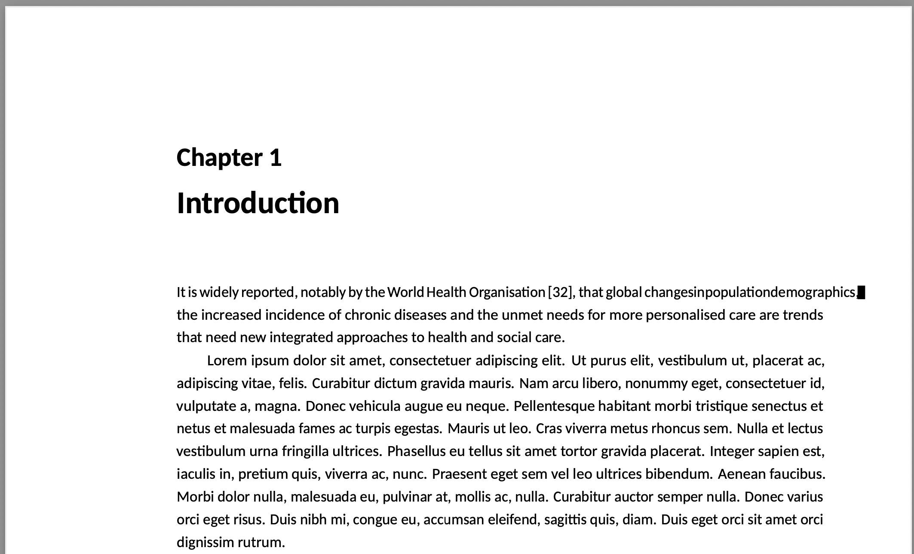
    </kbd>
</p>


The [oxengthesis.cls](oxengthesis.cls) class file is already takes advantage
of other packages (such as
[microtype](https://ctan.org/pkg/microtype?lang=en)) to deal with common
issues such as character protrusion, font expansion and inter-word spacing.
I recommend you slightly rephrase your guilty senteces instead of changing the
class template. This is usually the first approach many of my students take.

## Bibliography styles

The default style for the references is "*ieeetr*". For example, the
following LaTeX source:

```latex
...Finding reliable correspondences in two images of a scene taken from arbitrary viewpoints viewed with possibly different cameras and in different illumination conditions is a difficult and critical step towards fully automatic reconstruction of 3D scenes \cite{hartley2003multiple}...
```

will produce the following output in the content pages:

```
...Finding reliable correspondences in two images of a scene taken from arbitrary viewpoints viewed with possibly different cameras and in different illumination conditions is a difficult and critical step towards fully automatic reconstruction of 3D scenes [8]...
```

and the bibliography section will read:

```
Bibliography
...
[8] R. Hartley and A. Zisserman, Multiple view geometry in computer vision.
    Cambridge university press, 2003.
...
```

You can specify a custom bibliography style as an argument to the
"*listofreferences*" command in your "*main LaTeX source file*". For example,
the following command:


```latex
\listofreferences[apalike]
```

will use the [apalike](https://www.bibtex.com/s/bibliography-style-base-apalike/)
BibTeX style and produce the following output in the content pages:

```
...Finding reliable correspondences in two images of a scene taken from arbitrary viewpoints viewed with possibly different cameras and in different illumination conditions is a difficult and critical step towards fully automatic reconstruction of 3D scenes [Hartley and Zisserman, 2003]...
```

and the bibliography section will read:

```
Bibliography
...
[Hartley and Zisserman, 2003] Hartley, R. and Zisserman, A. (2003). Multiple
    view geometry in computer vision. Cambridge university press.
...
```

Take a look at the available styles at [The quick BibTeX guide](https://www.bibtex.com/styles/) online.

# Suggestions and feedback

Take a look at the [oxengthesis.cls](oxengthesis.cls) file and the
sample [sample_dphil_thesis.tex](sample_dphil_thesis.tex) / 
[sample_4yp_report.tex](sample_4yp_report.tex) documents for a more 
complete overview of what you can do with the provided LaTeX class template.
Additionally, review the documentation of the 
[memoir](https://ctan.org/pkg/memoir) LaTeX package. It is quite customisable
and provides many extra features not described here.

If you have any suggestions to improve the class template, don't hesitate
to contact me.